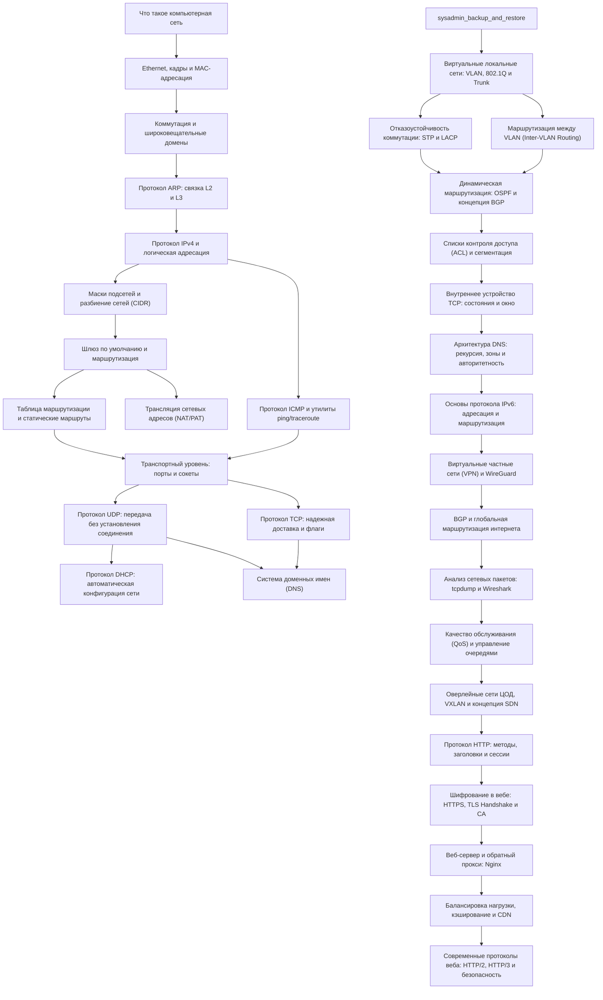

# Полный каталог трека «Компьютерные сети» (Networking Track)

> Данный документ содержит детальный структурированный разбор всех тем, уроков, практических лабораторных работ и интерактивных визуализаций, входящих в трек **«Сети»** на платформе персонального обучения.

## 1. Общая сводка и статистика трека

- **Всего уроков (Knowledge Nodes):** 33 темы
- **Теоретических материалов:** 33 MDX-лонгрида с разбором архитектуры, протоколов и дампов
- **Практических лабораторных работ (Cisco Packet Tracer / Linux):** 6 лаб
- **Интерактивных виджетов-симуляторов:** 3 визуализации (Ethernet Frame, Subnet CIDR Calculator, TCP 3-Way Handshake)
- **Логическое деление:** 3 последовательных блока:
  1. **Сетевой фундамент (L1 – L4)** — 15 уроков (от физики и витой пары до маршрутизации, TCP/UDP и DNS/NAT)
  2. **Корпоративные сети и инфраструктура (Enterprise L2/L3, BGP, SDN)** — 13 уроков (VLAN, STP, LACP, OSPF, ACL, WireGuard, BGP, Wireshark, QoS, VXLAN)
  3. **Сетевой стек современного веба (L7 & Web Infra)** — 5 уроков (HTTP/1.1, TLS 1.3, Nginx Reverse Proxy, Балансировка нагрузки/CDN, HTTP/2, HTTP/3/QUIC)

---

## 2. Сводная таблица всех 33 тем

|  №  | ID узла                             | Название темы                                                 | Блок                   | Требует (Pre-reqs)                                 | Открывает                                          | Лабораторная / Виджет               |
| :-: | :---------------------------------- | :------------------------------------------------------------ | :--------------------- | :------------------------------------------------- | :------------------------------------------------- | :---------------------------------- |
|  1  | `networking.network-basics`         | **Что такое компьютерная сеть**                               | Фундамент (L1-L4)      | — (Старт)                                          | `networking.ethernet`                              | —                                   |
|  2  | `networking.ethernet`               | **Ethernet, кадры и MAC-адресация**                           | Фундамент (L1-L4)      | `networking.network-basics`                        | `networking.switch`                                | Лаба: `pt-pc-pc`                    |
|  3  | `networking.switch`                 | **Коммутация и широковещательные домены**                     | Фундамент (L1-L4)      | `networking.ethernet`                              | `networking.arp`                                   | Лаба: `pt-switch-pc`                |
|  4  | `networking.arp`                    | **Протокол ARP: связка L2 и L3**                              | Фундамент (L1-L4)      | `networking.switch`                                | `networking.ipv4`                                  | Виджет: `network.packet-journey`    |
|  5  | `networking.ipv4`                   | **Протокол IPv4 и логическая адресация**                      | Фундамент (L1-L4)      | `networking.arp`                                   | `networking.subnetting`, `networking.icmp`         | —                                   |
|  6  | `networking.subnetting`             | **Маски подсетей и разбиение сетей (CIDR)**                   | Фундамент (L1-L4)      | `networking.ipv4`                                  | `networking.default-gateway`                       | Виджет: `network.subnet-calculator` |
|  7  | `networking.default-gateway`        | **Шлюз по умолчанию и маршрутизация**                         | Фундамент (L1-L4)      | `networking.subnetting`                            | `networking.routing-table`, `networking.nat`       | Лаба: `pt-lan-router-lan`           |
|  8  | `networking.routing-table`          | **Таблица маршрутизации и статические маршруты**              | Фундамент (L1-L4)      | `networking.default-gateway`                       | `networking.transport-basics`                      | —                                   |
|  9  | `networking.icmp`                   | **Протокол ICMP и утилиты ping/traceroute**                   | Фундамент (L1-L4)      | `networking.ipv4`                                  | `networking.transport-basics`                      | —                                   |
| 10  | `networking.transport-basics`       | **Транспортный уровень: порты и сокеты**                      | Фундамент (L1-L4)      | `networking.routing-table`, `networking.icmp`      | `networking.udp`, `networking.tcp`                 | —                                   |
| 11  | `networking.udp`                    | **Протокол UDP: передача без установления соединения**        | Фундамент (L1-L4)      | `networking.transport-basics`                      | `networking.dns`, `networking.dhcp`                | —                                   |
| 12  | `networking.tcp`                    | **Протокол TCP: надежная доставка и флаги**                   | Фундамент (L1-L4)      | `networking.transport-basics`                      | `networking.dns`, `networking.dhcp`                | Виджет: `network.tcp-handshake`     |
| 13  | `networking.dhcp`                   | **Протокол DHCP: автоматическая конфигурация сети**           | Фундамент (L1-L4)      | `networking.udp`                                   | Финал блока                                        | —                                   |
| 14  | `networking.dns`                    | **Система доменных имен (DNS)**                               | Фундамент (L1-L4)      | `networking.udp`, `networking.tcp`                 | Финал блока                                        | —                                   |
| 15  | `networking.nat`                    | **Трансляция сетевых адресов (NAT/PAT)**                      | Фундамент (L1-L4)      | `networking.default-gateway`                       | Финал блока                                        | Лаба: `pt-nat`                      |
| 16  | `netadv.vlan-and-trunking`          | **Виртуальные локальные сети: VLAN, 802.1Q и Trunk**          | Enterprise L2/L3 & SDN | `sysadmin.backup-and-restore`                      | `netadv.stp-and-lacp`, `netadv.inter-vlan-routing` | Лаба: `pt-vlan-trunk`               |
| 17  | `netadv.stp-and-lacp`               | **Отказоустойчивость коммутации: STP и LACP**                 | Enterprise L2/L3 & SDN | `netadv.vlan-and-trunking`                         | `netadv.dynamic-routing-ospf`                      | —                                   |
| 18  | `netadv.inter-vlan-routing`         | **Маршрутизация между VLAN (Inter-VLAN Routing)**             | Enterprise L2/L3 & SDN | `netadv.vlan-and-trunking`                         | `netadv.dynamic-routing-ospf`                      | —                                   |
| 19  | `netadv.dynamic-routing-ospf`       | **Динамическая маршрутизация: OSPF и концепция BGP**          | Enterprise L2/L3 & SDN | `netadv.stp-and-lacp`, `netadv.inter-vlan-routing` | `netadv.network-acls`                              | —                                   |
| 20  | `netadv.network-acls`               | **Списки контроля доступа (ACL) и сегментация**               | Enterprise L2/L3 & SDN | `netadv.dynamic-routing-ospf`                      | `netadv.tcp-internals`                             | —                                   |
| 21  | `netadv.tcp-internals`              | **Внутреннее устройство TCP: состояния и окно**               | Enterprise L2/L3 & SDN | `netadv.network-acls`                              | `netadv.dns-architecture`                          | —                                   |
| 22  | `netadv.dns-architecture`           | **Архитектура DNS: рекурсия, зоны и авторитетность**          | Enterprise L2/L3 & SDN | `netadv.tcp-internals`                             | `netadv.ipv6-fundamentals`                         | —                                   |
| 23  | `netadv.ipv6-fundamentals`          | **Основы протокола IPv6: адресация и маршрутизация**          | Enterprise L2/L3 & SDN | `netadv.dns-architecture`                          | `netadv.vpn-wireguard`                             | —                                   |
| 24  | `netadv.vpn-wireguard`              | **Виртуальные частные сети (VPN) и WireGuard**                | Enterprise L2/L3 & SDN | `netadv.ipv6-fundamentals`                         | `netadv.bgp-and-autonomous-systems`                | —                                   |
| 25  | `netadv.bgp-and-autonomous-systems` | **BGP и глобальная маршрутизация интернета**                  | Enterprise L2/L3 & SDN | `netadv.vpn-wireguard`                             | `netadv.packet-analysis-wireshark`                 | —                                   |
| 26  | `netadv.packet-analysis-wireshark`  | **Анализ сетевых пакетов: tcpdump и Wireshark**               | Enterprise L2/L3 & SDN | `netadv.bgp-and-autonomous-systems`                | `netadv.network-qos-and-queuing`                   | —                                   |
| 27  | `netadv.network-qos-and-queuing`    | **Качество обслуживания (QoS) и управление очередями**        | Enterprise L2/L3 & SDN | `netadv.packet-analysis-wireshark`                 | `netadv.overlay-vxlan-and-sdn`                     | —                                   |
| 28  | `netadv.overlay-vxlan-and-sdn`      | **Оверлейные сети ЦОД, VXLAN и концепция SDN**                | Enterprise L2/L3 & SDN | `netadv.network-qos-and-queuing`                   | `web.http-protocol-internals`                      | —                                   |
| 29  | `web.http-protocol-internals`       | **Протокол HTTP: методы, заголовки и сессии**                 | Web L7 & Reverse Proxy | `netadv.overlay-vxlan-and-sdn`                     | `web.tls-and-certificates`                         | —                                   |
| 30  | `web.tls-and-certificates`          | **Шифрование в вебе: HTTPS, TLS Handshake и CA**              | Web L7 & Reverse Proxy | `web.http-protocol-internals`                      | `web.nginx-reverse-proxy`                          | —                                   |
| 31  | `web.nginx-reverse-proxy`           | **Веб-сервер и обратный прокси: Nginx**                       | Web L7 & Reverse Proxy | `web.tls-and-certificates`                         | `web.load-balancing-and-caching`                   | Лаба: `sa-nginx-reverse-proxy`      |
| 32  | `web.load-balancing-and-caching`    | **Балансировка нагрузки, кэширование и CDN**                  | Web L7 & Reverse Proxy | `web.nginx-reverse-proxy`                          | `web.modern-protocols-and-security`                | —                                   |
| 33  | `web.modern-protocols-and-security` | **Современные протоколы веба: HTTP/2, HTTP/3 и безопасность** | Web L7 & Reverse Proxy | `web.load-balancing-and-caching`                   | `storage.block-file-object`                        | —                                   |

---

## 3. Интерактивная диаграмма связей (Roadmap)



---

## 4. Детальный каталог уроков (Все 33 темы)

### Тема 1: Что такое компьютерная сеть

- **Код узла (Node ID):** `networking.network-basics`
- **Название на английском:** _Computer Network Basics_
- **Файл контента:** `content/foundation/networking/01-network-basics.mdx`
- **Уровень сложности:** `foundation`
- **Пререквизиты (Требует):** _Стартовая тема трека_
- **Открывает темы:** `networking.ethernet`

#### 1.1. Суть концепции

Компьютерная сеть — это совокупность взаимодействующих вычислительных устройств (хостов), объединенных линиями связи для обмена данными и совместного использования ресурсов.

#### 1.2. Практическая ценность для инженера

Понимание сети необходимо каждому инженеру: любое современное клиент-серверное приложение, распределенная база данных или микросервис функционируют поверх сетевой инфраструктуры. Без фундаментальных знаний невозможно диагностировать задержки, сбои подключения или проблемы безопасности.

#### 1.3. Архитектура и протокол

Сети классифицируются по масштабу (LAN — локальные сети внутри здания, WAN — глобальные сети между городами и дата-центрами). Устройства связываются через физические среды: медную витую пару, оптическое волокно или радиоволны (Wi-Fi). Любое взаимодействие в сети базируется на декомпозиции задач по уровням моделей OSI и TCP/IP: от физического кодирования сигнала до уровня прикладного протокола.

#### 1.4. Контрольная точка

Убедитесь, что вы можете четко сформулировать разницу между LAN и WAN, назвать основные физические среды передачи данных и объяснить, почему стек протоколов делят на независимые уровни.

---

### Тема 2: Ethernet, кадры и MAC-адресация

- **Код узла (Node ID):** `networking.ethernet`
- **Название на английском:** _Ethernet, Frames and MAC Addressing_
- **Файл контента:** `content/foundation/networking/02-ethernet.mdx`
- **Уровень сложности:** `foundation`
- **Пререквизиты (Требует):** `networking.network-basics`
- **Открывает темы:** `networking.switch`
- **Практическая лабораторная работа:** `pt-pc-pc`
  - _Лабораторная:_ **Прямое соединение двух ПК (Cross-Over)** (Cisco Packet Tracer)
  - _Цель:_ Настроить адресацию и проверить сетевую связность между двумя ПК напрямую без промежуточных устройств.

#### 2.1. Суть концепции

Ethernet — доминирующая технология проводных локальных сетей (L2 Data Link). Основная единица передачи данных на канальном уровне называется кадром (frame), а адресация осуществляется с помощью 48-битных аппаратных адресов — MAC-адресов.

#### 2.2. Практическая ценность для инженера

На физическом уровне сигналы передаются по проводам, но устройствам необходим способ понять: где начинается порция данных, кому именно в сегменте сети она адресована и нет ли в ней ошибок передачи. MAC-адреса и заголовки кадров решают эту задачу.

#### 2.3. Архитектура и протокол

Каждый сетевой интерфейс (NIC) обладает уникальным MAC-адресом вида `00:1A:2B:3C:4D:5E`. Первые 3 байта (OUI) идентифицируют производителя, остальные 3 байта — уникальный номер чипа. Кадр Ethernet II содержит MAC-адрес получателя, MAC-адрес отправителя, поле типа протокола (EtherType, например `0x0800` для IPv4), полезную нагрузку (payload от 46 до 1500 байт) и контрольную сумму FCS (CRC32) для обнаружения повреждений.

#### 2.4. Контрольная точка

Выполните лабораторную работу `pt-pc-pc` в Packet Tracer. Проверьте структуру MAC-адреса своего сетевого интерфейса и убедитесь, что можете объяснить назначение контрольной суммы FCS в конце кадра Ethernet.

---

### Тема 3: Коммутация и широковещательные домены

- **Код узла (Node ID):** `networking.switch`
- **Название на английском:** _Switching and Broadcast Domains_
- **Файл контента:** `content/foundation/networking/03-switch.mdx`
- **Уровень сложности:** `foundation`
- **Пререквизиты (Требует):** `networking.ethernet`
- **Открывает темы:** `networking.arp`
- **Практическая лабораторная работа:** `pt-switch-pc`
  - _Лабораторная:_ **Локальная сеть на базе коммутатора (Switch LAN)** (Cisco Packet Tracer)
  - _Цель:_ Собрать топологию 'звезда' на коммутаторе 2960, исследовать работу таблицы MAC-адресов и широковещательных рассылок ARP.

#### 3.1. Суть концепции

Сетевой коммутатор (L2 Switch) — активное сетевое устройство, объединяющее множество хостов в единую локальную сеть на канальном уровне и изолирующее коллизии трафика между портами.

#### 3.2. Практическая ценность для инженера

Старые концентраторы (хабы) повторяли сигнал на все порты без разбора, порождая коллизии и снижая пропускную способность. Коммутаторы пересылают кадры строго адресату, обеспечивая высокую скорость передачи и микросегментацию.

#### 3.3. Архитектура и протокол

Коммутатор анализирует MAC-адрес источника входящего кадра и записывает связку `[MAC -> Номер порта]` в таблицу MAC-адресов (CAM-таблицу). При пересылке кадра коммутатор ищет MAC-адрес назначения в таблице: если запись есть — отправляет кадр только в соответствующий порт (Forwarding); если записи нет или адрес широковещательный (`FF:FF:FF:FF:FF:FF`) — рассылает кадр во все порты, кроме порта отправителя (Flooding).

#### 3.4. Контрольная точка

Выполните лабораторную работу `pt-switch-pc`. Убедитесь, что понимаете разницу между доменом коллизий (ограничен портом коммутатора) и широковещательным доменом (охватывает весь L2 сегмент коммутатора).

---

### Тема 4: Протокол ARP: связка L2 и L3

- **Код узла (Node ID):** `networking.arp`
- **Название на английском:** _ARP Protocol: Bridging L2 and L3_
- **Файл контента:** `content/foundation/networking/04-arp.mdx`
- **Уровень сложности:** `foundation`
- **Пререквизиты (Требует):** `networking.switch`
- **Открывает темы:** `networking.ipv4`
- **Интерактивный виджет:** `network.packet-journey`

#### 4.1. Суть концепции

Address Resolution Protocol (ARP) — протокол, связывающий логические IP-адреса сетевого уровня (L3) с физическими MAC-адресами канального уровня (L2) в пределах одного широковещательного сегмента.

#### 4.2. Практическая ценность для инженера

Операционная система знает IP-адрес целевого сервера, но сетевая карта Ethernet физически не может передать кадр, не зная MAC-адрес назначения в заголовке L2. ARP решает задачу автоматического обнаружения аппаратного адреса по IP.

#### 4.3. Архитектура и протокол

Когда хост хочет отправить пакет на IP-адрес `192.168.1.20`, он проверяет свой локальный ARP-кэш. Если записи нет, хост генерирует широковещательный ARP-запрос (ARP Request): «У кого IP `192.168.1.20`? Ответьте на мой MAC». Все компьютеры сегмента получают запрос, но отвечает только владелец IP-адреса через адресный ответ (ARP Reply Unicast). Результат сохраняется в ARP-таблице хоста.

#### 4.4. Контрольная точка

Запустите визуализацию путешествия пакета и проанализируйте, почему первый пакет в сети всегда предваряется ARP-запросом, и как работает ARP-спуфинг (ARP spoofing) с точки зрения безопасности.

---

### Тема 5: Протокол IPv4 и логическая адресация

- **Код узла (Node ID):** `networking.ipv4`
- **Название на английском:** _IPv4 Protocol and Logical Addressing_
- **Файл контента:** `content/foundation/networking/05-ipv4.mdx`
- **Уровень сложности:** `foundation`
- **Пререквизиты (Требует):** `networking.arp`
- **Открывает темы:** `networking.subnetting`, `networking.icmp`

#### 5.1. Суть концепции

Internet Protocol version 4 (IPv4) — базовый протокол сетевого уровня (L3), обеспечивающий логическую межсетевую адресацию и негарантированную доставку дейтаграмм (best-effort delivery) между компьютерами глобального интернета.

#### 5.2. Практическая ценность для инженера

MAC-адреса плоские и не содержат информации о географическом или топологическом расположении устройства. Невозможно построить глобальную маршрутизацию на миллиарды хостов только по MAC-адресам. IPv4 вводит иерархическую структуру, разделяя адрес на номер сети и номер хоста.

#### 5.3. Архитектура и протокол

Адрес IPv4 состоит из 32 бит, которые записываются в виде 4 десятичных октетов, разделенных точками (например, `192.168.1.1`). Заголовок IPv4 включает версию, длину заголовка (IHL), поле типа обслуживания (ToS/DSCP), общую длину пакета, идентификатор и флаги для фрагментации, время жизни (TTL — Time To Live), протокол следующего уровня (TCP, UDP, ICMP) и контрольную сумму заголовка.

#### 5.4. Контрольная точка

Убедитесь, что понимаете назначение поля TTL в заголовке IPv4 (защита от бесконечного зацикливания пакетов) и можете перевести десятичный октет (например, 192) в двоичный формат (`11000000`).

---

### Тема 6: Маски подсетей и разбиение сетей (CIDR)

- **Код узла (Node ID):** `networking.subnetting`
- **Название на английском:** _Subnet Masks and CIDR Subnetting_
- **Файл контента:** `content/foundation/networking/06-subnetting.mdx`
- **Уровень сложности:** `foundation`
- **Пререквизиты (Требует):** `networking.ipv4`
- **Открывает темы:** `networking.default-gateway`
- **Интерактивный виджет:** `network.subnet-calculator`

#### 6.1. Суть концепции

Маска подсети (Subnet Mask) и бесклассовая адресация (CIDR — Classless Inter-Domain Routing) — математический механизм, определяющий границу между идентификатором сети (Network ID) и идентификатором хоста (Host ID) внутри 32-битного IPv4-адреса.

#### 6.2. Практическая ценность для инженера

Без масок невозможно понять, находится ли целевой компьютер в той же локальной сети (и к нему можно обратиться напрямую по MAC через ARP) или в другой сети (и пакет необходимо отправить на маршрутизатор). Разбиение на подсети также экономит адресное пространство и изолирует сетевой трафик.

#### 6.3. Архитектура и протокол

Маска — это последовательность единичных бит, за которыми следуют нули. Запись `/24` означает 24 единичных бита (`255.255.255.0`). При побитовой операции `AND` между IP-адресом и маской вычисляется адрес сети:

- IP: `192.168.1.10/24`
- Маска: `255.255.255.0`
- Адрес сети: `192.168.1.0`
- Широковещательный адрес (все биты хоста = 1): `192.168.1.255`
- Доступно адресов для хостов: $2^{(32 - 24)} - 2 = 254$ хоста.

#### 6.4. Контрольная точка

Рассчитайте параметры для подсети `10.0.0.64/26`: определите адрес сети, маску в десятичном виде, диапазон доступных хостов и широковещательный адрес.

---

### Тема 7: Шлюз по умолчанию и маршрутизация

- **Код узла (Node ID):** `networking.default-gateway`
- **Название на английском:** _Default Gateway and Routing Basics_
- **Файл контента:** `content/foundation/networking/07-default-gateway.mdx`
- **Уровень сложности:** `foundation`
- **Пререквизиты (Требует):** `networking.subnetting`
- **Открывает темы:** `networking.routing-table`, `networking.nat`
- **Практическая лабораторная работа:** `pt-lan-router-lan`
  - _Лабораторная:_ **Маршрутизация между двумя сетями (LAN-Router-LAN)** (Cisco Packet Tracer)
  - _Цель:_ Настроить маршрутизатор для связи двух изолированных подсетей через шлюзы по умолчанию.

#### 7.1. Суть концепции

Шлюз по умолчанию (Default Gateway) — это интерфейс маршрутизатора (L3 устройства) в локальной сети, на который хосты отправляют весь сетевой трафик, предназначенный для адресов за пределами их собственной подсети.

#### 7.2. Практическая ценность для инженера

Компьютер не может отправить Ethernet-кадр напрямую хосту в удаленной сети через океан или дата-центр. Ему нужен промежуточный доверенный узел (маршрутизатор), который знает путь к другим сетям и осуществит дальнейшую пересылку.

#### 7.3. Архитектура и протокол

При отправке пакета стек TCP/IP сравнивает сеть назначения со своей подсетью:

1. Если адресат в **своей** подсети: отправляется ARP-запрос к IP адресата, кадр уходит напрямую.
2. Если адресат в **чужой** подсети: хост отправляет ARP-запрос к IP-адресу **шлюза по умолчанию**. Кадр упаковывается с MAC-адресом шлюза, но в заголовке IP остается конечный целевой IP-адрес.
   Маршрутизатор принимает кадр, снимает заголовок L2, смотрит в свою таблицу маршрутизации и пересылает пакет в следующий сегмент сети.

#### 7.4. Контрольная точка

Выполните лабораторную работу `pt-lan-router-lan` в Packet Tracer. Обратите внимание, как при пересылке пакета через маршрутизатор изменяются L2 MAC-заголовки кадра, в то время как IP-адреса источника и назначения в L3 пакете остаются неизменными.

---

### Тема 8: Таблица маршрутизации и статические маршруты

- **Код узла (Node ID):** `networking.routing-table`
- **Название на английском:** _Routing Table and Static Routes_
- **Файл контента:** `content/foundation/networking/08-routing-table.mdx`
- **Уровень сложности:** `foundation`
- **Пререквизиты (Требует):** `networking.default-gateway`
- **Открывает темы:** `networking.transport-basics`

#### 8.1. Суть концепции

Таблица маршрутизации (Routing Table) — структура данных в памяти операционной системы или маршрутизатора, содержащая перечень известных сетей, метрик, адресов следующих переходов (next-hop) и сетевых интерфейсов.

#### 8.2. Практическая ценность для инженера

Маршрутизатор должен принимать мгновенные решения по пересылке миллионов пакетов в секунду. Без формализованных правил и таблицы он не знает, через какой физический порт отправить транзитный пакет.

#### 8.3. Архитектура и протокол

При получении пакета маршрутизатор ищет соответствие IP-адреса назначения в своей таблице, используя правило **Longest Prefix Match** (выбирается маршрут с наибольшей длиной маски подсети):

- Если маршрут найден — пакет направляется на соответствующий next-hop IP или исходящий интерфейс.
- Если совпадений нет — пакет пересылается по маршруту по умолчанию `0.0.0.0/0` (Default Route).
- Если нет и маршрута по умолчанию — пакет отбрасывается, а отправителю посылается сообщение ICMP Destination Host/Network Unreachable.

#### 8.4. Контрольная точка

Посмотрите таблицу маршрутизации на своей рабочей станции с помощью команды `netstat -rn` (macOS/Linux) или `ip route` (Linux). Найдите строку маршрута по умолчанию (`default` или `0.0.0.0/0`) и адрес вашего домашнего шлюза.

---

### Тема 9: Протокол ICMP и утилиты ping/traceroute

- **Код узла (Node ID):** `networking.icmp`
- **Название на английском:** _ICMP Protocol, Ping and Traceroute_
- **Файл контента:** `content/foundation/networking/09-icmp.mdx`
- **Уровень сложности:** `foundation`
- **Пререквизиты (Требует):** `networking.ipv4`
- **Открывает темы:** `networking.transport-basics`

#### 9.1. Суть концепции

Internet Control Message Protocol (ICMP) — служебный протокол сетевого уровня, используемый сетевыми устройствами для передачи диагностических сообщений, уведомлений об ошибках и проверки доступности узлов.

#### 9.2. Практическая ценность для инженера

IP — протокол без гарантий доставки: если пакет отброшен из-за истечения TTL, переполнения буфера или отсутствия маршрута, отправитель об этом не узнает. ICMP предоставляет механизм обратной связи для диагностики сетевых сбоев.

#### 9.3. Архитектура и протокол

ICMP инкапсулируется непосредственно в IP-пакеты (код протокола 1). Основные типы сообщений:

- **Echo Request (тип 8) / Echo Reply (тип 0)**: используются утилитой `ping` для замера времени кругового пути (RTT — Round Trip Time) и проверки потерь.
- **Time Exceeded (тип 11)**: маршрутизатор возвращает отправителю, когда поле TTL в IP-заголовке уменьшается до 0. Утилита `traceroute` использует последовательную отправку пакетов с TTL = 1, 2, 3..., чтобы выявить каждый промежуточный узел на пути.
- **Destination Unreachable (тип 3)**: информирует о невозможности доставить пакет до сети, хоста или порта.

#### 9.4. Контрольная точка

Выполните `traceroute 1.1.1.1` (или `tracert` в Windows). Объясните, почему для построения цепочки маршрутизаторов утилита намеренно манипулирует полем TTL в заголовке IP.

---

### Тема 10: Транспортный уровень: порты и сокеты

- **Код узла (Node ID):** `networking.transport-basics`
- **Название на английском:** _Transport Layer: Ports and Sockets_
- **Файл контента:** `content/foundation/networking/10-transport-basics.mdx`
- **Уровень сложности:** `foundation`
- **Пререквизиты (Требует):** `networking.routing-table`, `networking.icmp`
- **Открывает темы:** `networking.udp`, `networking.tcp`

#### 10.1. Суть концепции

Транспортный уровень (L4) обеспечивает сквозную (end-to-end) доставку данных между конкретными процессами (приложениями) на хостах, используя логические порты и сокеты.

#### 10.2. Практическая ценность для инженера

IP-адрес доставляет данные только до компьютера в целом. Но на компьютере одновременно работают браузер, мессенджер, SSH-клиент и фоновые службы. Порты позволяют операционной системе мультиплексировать сетевой трафик и направлять пакеты именно тому приложению, для которого они предназначены.

#### 10.3. Архитектура и протокол

Порт — это 16-битное число от 0 до 65535:

- Системные порты (Well-Known): `0–1023` (HTTP 80, HTTPS 443, SSH 22, DNS 53).
- Зарегистрированные порты (Registered): `1024–49151` (PostgreSQL 5432, Redis 6379).
- Динамические/клиентские порты (Ephemeral): `49152–65535`.
  Сетевой сокет образуется комбинацией: `[IP-адрес:Порт:Протокол]` (например, `192.168.1.10:54321:TCP`). Полноценное сетевое соединение однозначно определяется кортежем из 5 элементов (5-tuple): IP источника, порт источника, IP назначения, порт назначения, транспортный протокол (TCP/UDP).

#### 10.4. Контрольная точка

Выполните команду `netstat -an` или `ss -tuln` в терминале и найдите список слушающих сокетов (`LISTEN`). Убедитесь, что понимаете разницу между IP-адресом (адрес хоста) и портом (адрес процесса).

---

### Тема 11: Протокол UDP: передача без установления соединения

- **Код узла (Node ID):** `networking.udp`
- **Название на английском:** _UDP: Connectionless Datagram Protocol_
- **Файл контента:** `content/foundation/networking/11-udp.mdx`
- **Уровень сложности:** `foundation`
- **Пререквизиты (Требует):** `networking.transport-basics`
- **Открывает темы:** `networking.dns`, `networking.dhcp`

#### 11.1. Суть концепции

User Datagram Protocol (UDP) — легковесный протокол транспортного уровня (L4), обеспечивающий отправку независимых дейтаграмм без предварительного рукопожатия, без подтверждения доставки и без контроля порядка следования.

#### 11.2. Практическая ценность для инженера

Для многих приложений (голосовая связь VoIP, видеостриминг, сетевые игры, DNS, DHCP) минимальная задержка критичнее стопроцентной надежности. Если аудиопакет опоздал на 300 мс из-за повторной отправки, он уже бесполезен для разговора.

#### 11.3. Архитектура и протокол

Заголовок UDP предельно минималистичен — всего 8 байт:

1. Порт источника (2 байта)
2. Порт назначения (2 байта)
3. Длина пакета (2 байта)
4. Контрольная сумма (2 байта)
   UDP работает по принципу «выстрелил и забыл» (fire and forget). В протоколе нет очередей повторной передачи (Retransmission) и нет механизмов регулирования скорости (Flow/Congestion control), что обеспечивает максимальную скорость и отсутствие накладных расходов.

#### 11.4. Контрольная точка

Сформулируйте ключевые различия в архитектуре заголовка UDP по сравнению с TCP и приведите не менее трех сценариев из реальной практики, где выбор UDP предпочтительнее TCP.

---

### Тема 12: Протокол TCP: надежная доставка и флаги

- **Код узла (Node ID):** `networking.tcp`
- **Название на английском:** _TCP: Reliable Stream Delivery and Flags_
- **Файл контента:** `content/foundation/networking/12-tcp.mdx`
- **Уровень сложности:** `foundation`
- **Пререквизиты (Требует):** `networking.transport-basics`
- **Открывает темы:** `networking.dns`, `networking.dhcp`
- **Интерактивный виджет:** `network.tcp-handshake`

#### 12.1. Суть концепции

Transmission Control Protocol (TCP) — протокол транспортного уровня (L4), обеспечивающий надежную, полнодуплексную передачу упорядоченного потока байтов с предварительной установкой логического соединения (3-way Handshake).

#### 12.2. Практическая ценность для инженера

Большинство сетевых протоколов (HTTP, SSH, SMTP, базы данных) требуют абсолютной гарантии целостности: ни один байт веб-страницы или финансовой транзакции не должен потеряться, продублироваться или прийти в неверном порядке. TCP берет эту сложнейшую работу на себя.

#### 12.3. Архитектура и протокол

Соединение TCP начинается с трехстороннего рукопожатия:

1. Клиент посылает флаг `[SYN]` со случайным стартовым номером последовательности ISN ($Seq = X$).
2. Сервер отвечает флагами `[SYN, ACK]` ($Seq = Y, Ack = X + 1$).
3. Клиент подтверждает флагом `[ACK]` ($Seq = X + 1, Ack = Y + 1$).
   После этого начинается обмен данными. Каждый полученный сегмент подтверждается квитанцией `ACK`. Если подтверждение не пришло в течение тайм-аута (RTO), TCP автоматически повторяет отправку сегмента. При завершении сессии стороны обмениваются флагами `[FIN] / [ACK]`.

#### 12.4. Контрольная точка

Опишите пошагово назначение флагов `SYN`, `ACK`, `FIN`, `RST` и объясните, как номера `Sequence Number` и `Acknowledgment Number` позволяют восстановить исходный порядок данных при нарушении очередности доставки в сети.

---

### Тема 13: Протокол DHCP: автоматическая конфигурация сети

- **Код узла (Node ID):** `networking.dhcp`
- **Название на английском:** _DHCP: Dynamic Host Configuration_
- **Файл контента:** `content/foundation/networking/13-dhcp.mdx`
- **Уровень сложности:** `foundation`
- **Пререквизиты (Требует):** `networking.udp`
- **Открывает темы:** _Финальная точка цепочки_

#### 13.1. Суть концепции

Dynamic Host Configuration Protocol (DHCP) — протокол прикладного уровня, работающий поверх UDP (порты 67 и 68), позволяющий хостам автоматически получать сетевые настройки (IP-адрес, маску, шлюз по умолчанию, DNS-сервера) при подключении к сети.

#### 13.2. Практическая ценность для инженера

Вручную настраивать статические IP-адреса на сотнях ноутбуков, смартфонов и рабочих станций долго и чревато конфликтами дублирующихся адресов. DHCP автоматизирует процесс выдачи и аренды параметров сети.

#### 13.3. Архитектура и протокол

Клиент получает настройки через процесс DORA из 4 шагов:

1. **Discover (DHCPDISCOVER)**: хост шлет широковещательный запрос в сеть (`255.255.255.255`), так как еще не имеет своего IP.
2. **Offer (DHCPOFFER)**: DHCP-сервер резервирует свободный IP и предлагает его клиенту.
3. **Request (DHCPREQUEST)**: клиент подтверждает выбор именно этого предложения.
4. **Acknowledge (DHCPACK)**: сервер закрепляет аренду (lease time) и отправляет полные сетевые параметры хосту.

#### 13.4. Контрольная точка

Вспомните 4 этапа процесса DORA и объясните, почему первые сообщения клиента обязательно отправляются широковещательно (Broadcast).

---

### Тема 14: Система доменных имен (DNS)

- **Код узла (Node ID):** `networking.dns`
- **Название на английском:** _Domain Name System (DNS)_
- **Файл контента:** `content/foundation/networking/14-dns.mdx`
- **Уровень сложности:** `foundation`
- **Пререквизиты (Требует):** `networking.udp`, `networking.tcp`
- **Открывает темы:** _Финальная точка цепочки_

#### 14.1. Суть концепции

Domain Name System (DNS) — глобальная иерархическая распределенная база данных и протокол прикладного уровня (порт 53 UDP/TCP), преобразующий человекопонятные доменные имена (например, `example.com`) в машинные IP-адреса (`93.184.216.34`).

#### 14.2. Практическая ценность для инженера

Людям сложно запоминать 32-битные или 128-битные цифровые адреса для сотен сайтов и сервисов. DNS делает интернет удобным для пользователей и позволяет менять серверы и IP-адреса без изменения доменного имени.

#### 14.3. Архитектура и протокол

Дерево DNS состоит из уровней: корневые серверы (Root `.`), серверы зон верхнего уровня (TLD `.ru`, `.com`), авторитетные серверы (Authoritative) конкретных доменов. Локальный резолвер отправляет рекурсивные и итеративные запросы. Основные типы ресурсных записей:

- `A` — привязка имени к IPv4-адресу.
- `AAAA` — привязка имени к IPv6-адресу.
- `CNAME` — канонический псевдоним (алиас) другого домена.
- `MX` — почтовый сервер для обработки писем домена.
- `NS` — делегирование зоны авторитетным DNS-серверам.
- `TXT` — текстовая информация (SPF, DKIM, верификация владения).

#### 14.4. Контрольная точка

Выполните утилиту `dig example.com A` или `nslookup example.com` в консоли. Найдите IP-адрес резолвера, время ответа (Query time) и секцию с полученными ресурсными записями `ANSWER SECTION`.

---

### Тема 15: Трансляция сетевых адресов (NAT/PAT)

- **Код узла (Node ID):** `networking.nat`
- **Название на английском:** _Network Address Translation (NAT/PAT)_
- **Файл контента:** `content/foundation/networking/15-nat.mdx`
- **Уровень сложности:** `foundation`
- **Пререквизиты (Требует):** `networking.default-gateway`
- **Открывает темы:** _Финальная точка цепочки_
- **Практическая лабораторная работа:** `pt-nat`
  - _Лабораторная:_ **Трансляция сетевых адресов (NAT / PAT)** (Cisco Packet Tracer)
  - _Цель:_ Настроить Dynamic PAT (Overload) для выхода компьютеров локальной сети в публичную сеть через один внешний IP.

#### 15.1. Суть концепции

Network Address Translation (NAT) и Port Address Translation (PAT / NAPT / NAT Overload) — технология модификации IP-адресов и портов в заголовках сетевых пакетов при их прохождении через пограничный маршрутизатор или фаервол.

#### 15.2. Практическая ценность для инженера

В 1990-х годах адресное пространство IPv4 (всего 4.3 млрд адресов) стало стремительно исчерпываться. NAT позволил миллионам устройств в приватных локальных сетях выходить в глобальный интернет, используя всего один или несколько публичных белых IP-адресов провайдера.

#### 15.3. Архитектура и протокол

Для локальных сетей зарезервированы диапазоны приватных адресов (RFC 1918): `10.0.0.0/8`, `172.16.0.0/12`, `192.168.0.0/16`. Эти адреса не маршрутизируются в публичном интернете. Маршрутизатор с поддержкой NAPT отслеживает исходящие сокеты:

1. Заменяет приватный IP источника (`192.168.1.10:45000`) на свой внешний публичный IP (`203.0.113.2:61001`).
2. Сохраняет соответствие в таблице трансляций NAT (State Table).
3. При получении ответного пакета восстанавливает приватный адрес и порт назначения и пересылает кадр клиенту.

#### 15.4. Контрольная точка

Выполните лабораторную работу `pt-nat` в Packet Tracer. Изучите таблицу трансляций с помощью команды `show ip nat translations` и объясните, почему входящие соединения из интернета в локальную сеть за NAT по умолчанию невозможны без проброса портов (Port Forwarding).

---

### Тема 16: Виртуальные локальные сети: VLAN, 802.1Q и Trunk

- **Код узла (Node ID):** `netadv.vlan-and-trunking`
- **Название на английском:** _Virtual LANs: VLAN, 802.1Q and Trunking_
- **Файл контента:** `content/foundation/networking-advanced/01-vlan-and-trunking.mdx`
- **Уровень сложности:** `foundation`
- **Пререквизиты (Требует):** `sysadmin.backup-and-restore`
- **Открывает темы:** `netadv.stp-and-lacp`, `netadv.inter-vlan-routing`
- **Практическая лабораторная работа:** `pt-vlan-trunk`
  - _Лабораторная:_ **Настройка VLAN и 802.1Q Trunk на коммутаторе** (Cisco Packet Tracer)
  - _Цель:_ Разделить локальную сеть на два изолированных широковещательных домена (VLAN 10 и VLAN 20) и настроить Trunk-канал между коммутаторами.

#### 16.1. Суть концепции

Virtual Local Area Network (VLAN) — технология канального уровня (L2), позволяющая логически разделить один физический коммутатор на множество изолированных широковещательных доменов. Магистральный канал (Trunk) передает трафик нескольких VLAN по одному физическому кабелю с добавлением тега IEEE 802.1Q.

#### 16.2. Практическая ценность для инженера

В единой плоской сети (Flat Network) широковещательный шторм (Broadcast Storm) или скомпрометированный компьютер бухгалтерии ставят под угрозу безопасность серверов баз данных. Сегментация на VLAN локализует широковещательный трафик, повышает производительность и выстраивает эшелонированную защиту.

#### 16.3. Архитектура и протокол

Порты коммутатора работают в режиме Access (передают нетегированный трафик одной конкретной VLAN) или Trunk (добавляют в заголовок Ethernet-кадра 4 байта тега 802.1Q, содержащие 12-битный идентификатор VLAN ID от 1 до 4094). Кадры между разными VLAN внутри L2-коммутатора не передаются: изоляция абсолютна на канальном уровне.

#### 16.4. Контрольная точка

Опишите формат тега IEEE 802.1Q (размер и назначение поля VLAN ID) и поясните, что произойдет с нетегированным кадром, пришедшим в порт режима Trunk (концепция Native VLAN).

---

### Тема 17: Отказоустойчивость коммутации: STP и LACP

- **Код узла (Node ID):** `netadv.stp-and-lacp`
- **Название на английском:** _Switching Redundancy: STP and LACP Link Aggregation_
- **Файл контента:** `content/foundation/networking-advanced/02-stp-and-lacp.mdx`
- **Уровень сложности:** `foundation`
- **Пререквизиты (Требует):** `netadv.vlan-and-trunking`
- **Открывает темы:** `netadv.dynamic-routing-ospf`

#### 17.1. Суть концепции

Протокол связующего дерева (Spanning Tree Protocol, STP / RSTP 802.1w) предотвращает образование петель коммутации в избыточных топологиях L2. Агрегация каналов (Link Aggregation Control Protocol, LACP 802.3ad / Port Channel) объединяет несколько физических линков в один логический высокоскоростной транк.

#### 17.2. Практическая ценность для инженера

Физическое резервирование линий связи необходимо для непрерывности бизнеса: если упадет один кабель или свитч, трафик должен мгновенно пойти по запасному пути. Однако без STP кольцо в L2 приводит к бесконечной циркуляции широковещательных кадров (Broadcast Storm) и полному отказу сети за секунды.

#### 17.3. Архитектура и протокол

Коммутаторы обмениваются служебными пакетами BPDU (Bridge Protocol Data Units) и выбирают корневой мост (Root Bridge). STP блокирует избыточные порты (состояние Blocking/Discarding), оставляя единственное логическое дерево без петель. При обрыве активной линии заблокированный порт автоматически переводится в состояние Forwarding. LACP параллельно агрегирует от 2 до 8 физических интерфейсов, балансируя потоки трафика по хэшу от MAC/IP/портов источника и назначения.

#### 17.4. Контрольная точка

Объясните, почему петля на канальном уровне L2 приводит к катастрофическому падению сети (в отличие от L3, где есть поле TTL в заголовке IP).

---

### Тема 18: Маршрутизация между VLAN (Inter-VLAN Routing)

- **Код узла (Node ID):** `netadv.inter-vlan-routing`
- **Название на английском:** _Inter-VLAN Routing and Layer 3 Switching_
- **Файл контента:** `content/foundation/networking-advanced/03-inter-vlan-routing.mdx`
- **Уровень сложности:** `foundation`
- **Пререквизиты (Требует):** `netadv.vlan-and-trunking`
- **Открывает темы:** `netadv.dynamic-routing-ospf`

#### 18.1. Суть концепции

Inter-VLAN Routing — механизм передачи сетевых пакетов между изолированными виртуальными сетями с помощью пограничного маршрутизатора (архитектура Router-on-a-Stick) или многоуровневого коммутатора третьего уровня (L3 Switch / SVI).

#### 18.2. Практическая ценность для инженера

VLAN создаются для изоляции, однако хостам из клиентского сегмента все равно требуется доступ к общим корпоративным ресурсам (почте, DNS, веб-серверам). Маршрутизация между VLAN позволяет соединять сети контролируемо, применяя фильтрацию и политики безопасности на стыке.

#### 18.3. Архитектура и протокол

В схеме Router-on-a-Stick физический интерфейс маршрутизатора делят на подынтерфейсы (Subinterfaces, например `g0/0.10` и `g0/0.20`), на каждом из которых настраивается инкапсуляция `encapsulation dot1Q [VLAN_ID]` и назначается IP-адрес шлюза. В L3-коммутаторах маршрутизация выполняется на специализированных чипах (ASIC) на скорости проводной среды через виртуальные интерфейсы коммутатора (Switch Virtual Interface, SVI: `interface vlan 10`).

#### 18.4. Контрольная точка

Сравните подходы Router-on-a-Stick и L3 Switch с SVI по критериям пропускной способности, аппаратных затрат и масштабируемости в дата-центре.

---

### Тема 19: Динамическая маршрутизация: OSPF и концепция BGP

- **Код узла (Node ID):** `netadv.dynamic-routing-ospf`
- **Название на английском:** _Dynamic Routing: OSPF and BGP Concepts_
- **Файл контента:** `content/foundation/networking-advanced/04-dynamic-routing-ospf.mdx`
- **Уровень сложности:** `foundation`
- **Пререквизиты (Требует):** `netadv.stp-and-lacp`, `netadv.inter-vlan-routing`
- **Открывает темы:** `netadv.network-acls`

#### 19.1. Суть концепции

Протоколы динамической маршрутизации (Dynamic Routing) автоматически распространяют информацию о топологии сети между маршрутизаторами. OSPF (Open Shortest Path First) — протокол внутреннего шлюза (IGP), а BGP (Border Gateway Protocol) — протокол внешнего шлюза (EGP), управляющий глобальной связностью между автономными системами (AS) интернета.

#### 19.2. Практическая ценность для инженера

Статические маршруты непригодны в корпоративных сетях из десятков и сотен маршрутизаторов: ручное обновление таблиц при падении любого канала приводит к ошибкам и длительным простоям. Динамические протоколы самостоятельно пересчитывают оптимальные маршруты в реальном времени.

#### 19.3. Архитектура и протокол

OSPF относится к протоколам состояния канала (Link-State). Все маршрутизаторы в зоне (Area) обмениваются LSA-объявлениями, строят полную базу топологии (LSDB) и рассчитывают кратчайший путь с помощью алгоритма Дейкстры (SPF), учитывая метрику стоимости (Cost, обратно пропорциональную пропускной способности интерфейса). BGP использует дистанционно-векторную модель путей (Path-Vector) и оперирует цепочками номеров автономных систем (AS-Path) и бизнес-политиками транзита.

#### 19.4. Контрольная точка

В чем принципиальная разница между IGP (внутрикорпоративная маршрутизация на базе OSPF) и EGP (межоператорская маршрутизация на базе BGP)?

---

### Тема 20: Списки контроля доступа (ACL) и сегментация

- **Код узла (Node ID):** `netadv.network-acls`
- **Название на английском:** _Network Access Control Lists (ACLs) and Segmentation_
- **Файл контента:** `content/foundation/networking-advanced/05-network-acls.mdx`
- **Уровень сложности:** `foundation`
- **Пререквизиты (Требует):** `netadv.dynamic-routing-ospf`
- **Открывает темы:** `netadv.tcp-internals`

#### 20.1. Суть концепции

Список контроля доступа (Access Control List, ACL) — упорядоченный набор правил фильтрации входящих и исходящих пакетов на сетевом оборудовании (маршрутизаторах, фаерволах) по IP-адресам, номерам протоколов L4 и портам TCP/UDP.

#### 20.2. Практическая ценность для инженера

Сегментация сети на канальном уровне (VLAN) и сетевом уровне (подсети) не имеет смысла, если между ними разрешен неограниченный обмен. ACL реализуют барьеры безопасности (границы периметра), блокируя запрещенный трафик на самых ранних рубежах маршрутизации.

#### 20.3. Архитектура и протокол

Стандартные ACL фильтруют пакеты только по IP-адресу источника. Расширенные ACL (Extended ACL) анализируют протокол (IP, TCP, UDP, ICMP), IP источника и назначения, а также диапазон портов (например, `permit tcp 192.168.1.0 0.0.0.255 host 10.0.0.5 eq 443`). Правила проверяются сверху вниз до первого совпадения. В конце любого ACL всегда неявно присутствует правило `deny ip any any` (Implicit Deny).

#### 20.4. Контрольная точка

Почему в конец списка ACL всегда неявно помещается правило запрета (Implicit Deny), и к какому интерфейсу и направлению (inbound/outbound) эффективнее привязывать фильтрующие правила?

---

### Тема 21: Внутреннее устройство TCP: состояния и окно

- **Код узла (Node ID):** `netadv.tcp-internals`
- **Название на английском:** _TCP Internals: State Machine, Sliding Window and MTU_
- **Файл контента:** `content/foundation/networking-advanced/06-tcp-internals.mdx`
- **Уровень сложности:** `foundation`
- **Пререквизиты (Требует):** `netadv.network-acls`
- **Открывает темы:** `netadv.dns-architecture`

#### 21.1. Суть концепции

Глубокое понимание протокола TCP охватывает автомат состояний сокетов (State Machine), механизм скользящего окна (Sliding Window) для контроля потока и перегрузок, а также параметры согласования максимального размера пакета (MTU и MSS).

#### 21.2. Практическая ценность для инженера

Инженеры сталкиваются с сетевыми аномалиями: переполнением сокетов в состоянии TIME_WAIT, зависанием сессий из-за неверного MTU (черные дыры Path MTU Discovery) и просадками скорости передачи данных по гигабитным каналам с высокой задержкой (BDP).

#### 21.3. Архитектура и протокол

При разрыве соединения инициатор переходит в состояние `TIME_WAIT` (на время 2MSL, обычно 60–120 секунд), чтобы предотвратить пересечение пакетов старой сессии с новой. Скользящее окно регулирует объем байт, который отправитель может выдать в сеть без подтверждения (ACK). При прохождении через VPN/PPPoE заголовок туннеля уменьшает эффективный размер полезной нагрузки (MSS Clamping), предотвращая фрагментацию пакетов.

#### 21.4. Контрольная точка

Объясните, для чего необходимо состояние сокета TIME_WAIT, и почему при несоответствии MTU на маршрутизаторе и отключенном ICMP сессия TCP может зависать при передаче больших объемов данных.

---

### Тема 22: Архитектура DNS: рекурсия, зоны и авторитетность

- **Код узла (Node ID):** `netadv.dns-architecture`
- **Название на английском:** _DNS Architecture: Recursion, Authoritative Servers and TTL_
- **Файл контента:** `content/foundation/networking-advanced/07-dns-architecture.mdx`
- **Уровень сложности:** `foundation`
- **Пререквизиты (Требует):** `netadv.tcp-internals`
- **Открывает темы:** `netadv.ipv6-fundamentals`

#### 22.1. Суть концепции

Система доменных имен (DNS) — глобальная распределенная иерархическая база данных, обеспечивающая преобразование человекопонятных доменных имен в сетевые IP-адреса и распределение служебных метаданных (MX, TXT, SRV).

#### 22.2. Практическая ценность для инженера

Почти любая пользовательская активность в интернете начинается с DNS-запроса. Отказ DNS равносилен отключению интернета. Понимание разницы между рекурсивными резолверами и авторитетными серверами зон критично для корректного делегирования доменов, настройки корпоративной почты и CDN.

#### 22.3. Архитектура и протокол

Иерархия DNS строится сверху вниз: корневые серверы (Root, 13 буквенных кластеров), серверы доменов верхнего уровня (TLD: .com, .ru) и авторитетные серверы конкретной зоны (Authoritative Name Servers). Рекурсивный резолвер (например, 1.1.1.1 или провайдерский DNS) по цепочке опрашивает узлы и кэширует ответ на время, заданное значением TTL (Time-to-Live). Основные типы записей: A (IPv4), AAAA (IPv6), CNAME (канонический псевдоним), MX (почтовый шлюз), TXT (верификация владения, SPF/DKIM/DMARC) и NS (делегирование авторитетности).

#### 22.4. Контрольная точка

Проследите путь рекурсивного запроса при первом обращении клиента к домену `api.example.com` и объясните значение и риски завышенного или заниженного параметра TTL для записи DNS.

---

### Тема 23: Основы протокола IPv6: адресация и маршрутизация

- **Код узла (Node ID):** `netadv.ipv6-fundamentals`
- **Название на английском:** _IPv6 Fundamentals: Addressing, Scopes and Routing_
- **Файл контента:** `content/foundation/networking-advanced/08-ipv6-fundamentals.mdx`
- **Уровень сложности:** `foundation`
- **Пререквизиты (Требует):** `netadv.dns-architecture`
- **Открывает темы:** `netadv.vpn-wireguard`

#### 23.1. Суть концепции

IPv6 — следующее поколение межсетевого протокола, использующее 128-битные адреса (вместо 32-битных в IPv4), предоставляющее астрономическое адресное пространство ($3.4 \times 10^{38}$ адресов), встроенную автоконфигурацию SLAAC и упрощенный заголовок без контрольной суммы.

#### 23.2. Практическая ценность для инженера

Адреса IPv4 глобально исчерпаны, а использование NAT усложняет архитектуру приложений (P2P, WebRTC, VoIP). В современных мобильных сетях, дата-центрах и зарубежных магистралях IPv6 уже является доминирующим стандартом.

#### 23.3. Архитектура и протокол

Адрес записывается 8 группами по 4 шестнадцатеричных символа (`2001:0db8:85a3:0000:0000:8a2e:0370:7334`). Нулевые группы сокращаются с помощью `::` (один раз в адресе). IPv6 разделяет типы адресов: Link-Local (`fe80::/10`, генерируются автоматически на каждом интерфейсе для общения в пределах одного канала), Global Unicast (`2000::/3`, маршрутизируемые публичные адреса) и Multicast (`ff00::/8`). В протоколе IPv6 полностью устранен широковещательный трафик (Broadcast) — его функции выполняет протокол Neighbor Discovery Protocol (NDP) на базе ICMPv6.

#### 23.4. Контрольная точка

Назовите назначение адресов Link-Local в IPv6 (`fe80::/10`) и объясните, какой протокол заменил классический ARP в сетях IPv6.

---

### Тема 24: Виртуальные частные сети (VPN) и WireGuard

- **Код узла (Node ID):** `netadv.vpn-wireguard`
- **Название на английском:** _Virtual Private Networks (VPN) and WireGuard_
- **Файл контента:** `content/foundation/networking-advanced/09-vpn-wireguard.mdx`
- **Уровень сложности:** `foundation`
- **Пререквизиты (Требует):** `netadv.ipv6-fundamentals`
- **Открывает темы:** `netadv.bgp-and-autonomous-systems`

#### 24.1. Суть концепции

Виртуальная частная сеть (VPN) — технология создания защищенного логического зашифрованного туннеля поверх незащищенной публичной сети (интернета). WireGuard — современный, легковесный и высокопроизводительный протокол VPN, использующий современную криптографию (Noise protocol framework, Curve25519, ChaCha20-Poly1305).

#### 24.2. Практическая ценность для инженера

Традиционные протоколы VPN (IPsec, OpenVPN) содержат сотни тысяч строк кода, сложны в конфигурации и создают высокие накладные расходы на шифрование. WireGuard состоит менее чем из 4000 строк кода в ядре Linux, работает на порядки быстрее и обеспечивает мгновенный роуминг при смене IP-адреса клиента.

#### 24.3. Архитектура и протокол

WireGuard реализует концепцию Cryptokey Routing: каждому пиру (Peer) сопоставляется его открытый асимметричный ключ и разрешенный пул IP-адресов (`AllowedIPs`). Туннельный виртуальный интерфейс (например, `wg0`) работает на сетевом уровне L3. При отправке пакета ядро сверяет IP назначения с `AllowedIPs`, шифрует полезную нагрузку открытым ключом целевого пира и оборачивает пакет в стандартную UDP-датаграмму.

#### 24.4. Контрольная точка

Объясните концепцию Cryptokey Routing в WireGuard и опишите роль параметра `AllowedIPs` как со стороны клиента, так и со стороны сервера.

---

### Тема 25: BGP и глобальная маршрутизация интернета

- **Код узла (Node ID):** `netadv.bgp-and-autonomous-systems`
- **Название на английском:** _BGP and Autonomous Systems_
- **Файл контента:** `content/foundation/networking-advanced/10-bgp-and-autonomous-systems.mdx`
- **Уровень сложности:** `foundation`
- **Пререквизиты (Требует):** `netadv.vpn-wireguard`
- **Открывает темы:** `netadv.packet-analysis-wireshark`

#### 25.1. Суть концепции

Border Gateway Protocol (BGP) — стандартизированный протокол динамической маршрутизации внешнего шлюза (EGP), обеспечивающий обмен информацией о доступности сетевых префиксов между независимыми автономными системами (AS) в глобальной сети Интернет. В отличие от протоколов внутреннего шлюза (IGP: OSPF, IS-IS), оптимизирующих метрику задержки или пропускной способности внутри одной организации, BGP является протоколом вектора пути (path-vector protocol), где маршрутные решения принимаются на основе административных политик, договорных отношений между операторами и правил фильтрации.

Автономная система (AS) представляет собой совокупность IP-сетей и маршрутизаторов, управляемых единой организацией или интернет-провайдером (ISP) и имеющих четко определенную внешнюю политику маршрутизации. Каждой AS выделяется глобально уникальный 16-битный или 32-битный номер ASN (Autonomous System Number), администрируемый региональными интернет-регистраторами (RIR, такими как RIPE NCC, ARIN, APNIC).

#### 25.2. Практическая ценность для инженера

Понимание BGP критично для сетевых инженеров, архитекторов облачных решений и DevOps-специалистов, работающих с отказоустойчивой инфраструктурой, дата-центрами и multi-homing подключениями. Без протокола BGP существование глобального интернета было бы невозможно: только он способен масштабироваться до таблицы полного маршрутного покрытия (Full View), насчитывающей сотни тысяч префиксов.

В enterprise-среде знание BGP необходимо для:

- Организации отказоустойчивого подключения организации к двум и более интернет-провайдерам (Dual-Homing / Multi-Homing) с автоматическим переключением каналов при аварии на магистрали;
- Анонсирования собственных блоков публичных IP-адресов (Provider-Independent, PI-адресация);
- Настройки прямого высокоскоростного пиринга с облачными провайдерами (AWS Direct Connect, Azure ExpressRoute, Cloudflare Magic Transit);
- Управления балансировкой входящего и исходящего трафика между географически распределенными площадками и дата-центрами.

#### 25.3. Архитектура и протокол

Протокол BGP разделяется на два режима взаимодействия:

- **eBGP (External BGP)**: устанавливается между маршрутизаторами разных автономных систем. Как правило, пиры соединены напрямую через физический линк (TTL пакета по умолчанию равен 1), а при передаче маршрута в eBGP маршрутизатор дописывает свой номер ASN в начало атрибута `AS_PATH`.
- **iBGP (Internal BGP)**: используется для распространения внешних маршрутов внутри одной и той же автономной системы. Требует полносвязной топологии (Full Mesh) либо использования отражателей маршрутов (BGP Route Reflectors, RR) и конфедераций, так как iBGP не модифицирует `AS_PATH` и по умолчанию не передает маршрут от одного iBGP-соседа другому для предотвращения петель.

Установление соседства в BGP происходит поверх надежного транспортного протокола TCP (порт 179). Сессия проходит через последовательность состояний: `Idle` → `Connect` → `Active` → `OpenSent` → `OpenConfirm` → `Established`. Маршрутизаторы обмениваются четырьмя типами сообщений: `OPEN` (согласование параметров, ASN и таймеров), `KEEPALIVE` (поддержание связи), `UPDATE` (анонсирование и отзыв сетевых префиксов с набором атрибутов) и `NOTIFICATION` (сигнал о критической ошибке и разрыв сессии).

При выборе наилучшего пути к целевому префиксу BGP применяет детерминированный алгоритм сравнения атрибутов (Best Path Selection):

1. Наибольший `Weight` (локальный проприетарный вес маршрутизатора Cisco);
2. Наибольший `LOCAL_PREF` (локальный приоритет для всей AS, определяющий выбор пути исходящего трафика);
3. Маршруты, сгенерированные локально на данном маршрутизаторе (`network`, `aggregate`);
4. Кратчайший `AS_PATH` (наименьшее число автономных систем в цепочке пути);
5. Тип происхождения маршрута (`Origin`: IGP предпочтительнее EGP и Incomplete);
6. Наименьший `MED` (Multi-Exit Discriminator, предлагающий соседней AS предпочтительную точку входа для входящего трафика);
7. Предпочтение eBGP маршрутов перед iBGP;
8. Наименьшая внутренняя метрика IGP до следующего перехода (`Next-Hop`).

#### 25.4. Контрольная точка

1. Объясните принципиальное различие между `eBGP` и `iBGP` с точки зрения проверки на петли маршрутизации и модификации атрибута `AS_PATH`.
2. Каким образом атрибут `LOCAL_PREF` позволяет компании с двумя провайдерами (ISP-1 и ISP-2) направить весь исходящий веб-трафик через быстрый ISP-1, используя резервный ISP-2 только при обрыве основного линка?
3. Что происходит с BGP-сессией при получении сообщения `NOTIFICATION` и по какому транспортному протоколу передаются все сообщения BGP?

---

### Тема 26: Анализ сетевых пакетов: tcpdump и Wireshark

- **Код узла (Node ID):** `netadv.packet-analysis-wireshark`
- **Название на английском:** _Packet Analysis: tcpdump and Wireshark_
- **Файл контента:** `content/foundation/networking-advanced/11-packet-analysis-wireshark.mdx`
- **Уровень сложности:** `foundation`
- **Пререквизиты (Требует):** `netadv.bgp-and-autonomous-systems`
- **Открывает темы:** `netadv.network-qos-and-queuing`

#### 26.1. Суть концепции

Анализ сетевых пакетов (Packet Analysis / Packet Sniffing) — фундаментальная инженерная методология перехвата, декодирования и детального побайтового исследования сетевого трафика, проходящего через сетевой интерфейс. Главными инструментами анализа являются консольная утилита `tcpdump` (использующая библиотеку перехвата пакетов libpcap/winpcap) и графический интерактивный анализатор протоколов `Wireshark`.

Формат файлов дампа сетевого трафика (`.pcap` и современный расширенный стандарт `.pcapng`) позволяет сохранять захваченные фреймы канального уровня вместе с наносекундными таймстемпами для последующего офлайн-анализа, судебно-сетевой экспертизы и воспроизведения сценариев сбоя.

#### 26.2. Практическая ценность для инженера

Умение «слушать» и читать сырой сетевой трафик — это высший навык диагностики в сетевой инженерии, системном администрировании и кибербезопасности. Когда прикладные логи приложений, веб-серверов или базы данных сообщают абстрактную ошибку «Connection timed out» или «SSL Handshake failed», анализ дампа пакетов показывает физическую правду:

- Был ли отправлен TCP SYN-пакет и пришел ли на него RST от промежуточного файрвола;
- Происходит ли потеря пакетов и повторная передача (TCP Retransmission);
- Корректно ли сервер согласовал шифронабор (Cipher Suite) и цепочку сертификатов в TLS Client Hello/Server Hello;
- Не искажаются ли пакеты при прохождении через NAT или прокси (MTU Black Hole, фрагментация пакетов).

В информационной безопасности анализ PCAP незаменим при расследовании инцидентов (Incident Response), обнаружении сетевых атак, сигнатур вредоносного ПО и каналов утечки данных (C2-трафик).

#### 26.3. Архитектура и протокол

Для перехвата трафика сетевая карта переводится в неразборчивый режим (Promiscuous Mode), при котором сетевой контроллер передает операционной системе все принятые кадры, а не только адресованные собственному MAC-адресу или широковещательные.

1. **Захват через `tcpdump` на сервере**:
   Служит для фиксации сетевых событий на удаленных серверах без графического интерфейса:

   ```bash
   # Захват 1000 пакетов на интерфейсе eth0 с фильтром по порту 443 в файл trace.pcap
   tcpdump -i eth0 -nn -s 0 -w trace.pcap "tcp port 443 and host 192.168.1.50"
   ```

   Синтаксис фильтрации опирается на стандарт Berkeley Packet Filter (BPF), исполняемый прямо в ядре ОС для минимизации накладных расходов.

2. **Анализ в `Wireshark`**:
   Wireshark предоставляет мощный графический движок диссекторов сотен сетевых протоколов:
   - **Фильтры отображения (Display Filters)**: синтаксис вида `tcp.analysis.retransmission`, `http.response.code >= 400`, `dns.flags.response == 1 && dns.time > 0.1`;
   - **Follow TCP Stream**: автоматическая реконструкция прикладного потока данных (Stream Reassembly) из отдельных сегментов с отображением диалога клиента и сервера;
   - **Графики IO и RTT**: анализ динамики окна TCP Window Size, задержек Round-Trip Time и обнаружения узких мест пропускной способности канала.

#### 26.4. Контрольная точка

1. В чем заключается фундаментальная разница между фильтрами захвата (Capture Filters / BPF) в `tcpdump` и фильтрами отображения (Display Filters) в `Wireshark`?
2. Какие признаки в дампе трафика Wireshark однозначно указывают на потерю пакетов в канале и задержки в работе стека TCP?
3. Сформулируйте команду `tcpdump` для перехвата DNS-запросов (порт 53 UDP) на интерфейсе `eth0` с сохранением в файл `dns.pcap`.

---

### Тема 27: Качество обслуживания (QoS) и управление очередями

- **Код узла (Node ID):** `netadv.network-qos-and-queuing`
- **Название на английском:** _Quality of Service (QoS) and Queuing_
- **Файл контента:** `content/foundation/networking-advanced/12-network-qos-and-queuing.mdx`
- **Уровень сложности:** `foundation`
- **Пререквизиты (Требует):** `netadv.packet-analysis-wireshark`
- **Открывает темы:** `netadv.overlay-vxlan-and-sdn`

#### 27.1. Суть концепции

Quality of Service (QoS, качество обслуживания) — комплекс сетевых технологий, протоколов и механизмов управления ресурсами полосы пропускания, обеспечивающий дифференцированную обработку различных типов трафика на сетевом оборудовании. В условиях ограниченной пропускной способности каналов передачи данных QoS предотвращает деградацию чувствительного к задержкам трафика за счет приоритизации, резервирования гарантированной полосы и управляемого сброса избыточных пакетов.

Ключевыми метриками качества сети, регулируемыми QoS, являются:

- **Bandwidth (пропускная способность)**: максимальный объем данных в единицу времени;
- **Delay / Latency (задержка)**: время доставки пакета от отправителя к получателю;
- **Jitter (джиттер)**: вариация задержки между последовательными пакетами одного потока;
- **Packet Loss (потери пакетов)**: процент пакетов, отброшенных буферами сетевых устройств при перегрузке.

#### 27.2. Практическая ценность для инженера

В современных конвергентных сетях по одному физическому кабелю или оптоволоконному каналу одновременно передаются совершенно разные типы данных: видеотрансляции высокой четкости, звонки IP-телефонии (VoIP), критичный финансовый обмен транзакциями, резервное копирование бэкапов и обычный веб-серфинг.

Без внедрения механизмов QoS запуск фонового бэкапа базы данных или загрузка большого файла мгновенно забьет буферы коммутатора/маршрутизатора (явление Bufferbloat). Это приведет к резкому скачку задержек и выпадению аудиопакетов в телефонных звонках или видеоконференциях. Настройка QoS гарантирует, что VoIP и критический бизнес-трафик получат наивысший приоритет и минимальную задержку в любых условиях загрузки сети.

#### 27.3. Архитектура и протокол

Архитектура QoS состоит из четырех последовательных этапов обработки трафика на каждом сетевом узле:

1. **Классификация и маркировка (Classification & Marking)**:
   При входе пакета в сеть (на пограничном устройстве) трафик классифицируется по протоколу, портам или ACL. В заголовке пакета выставляется маркер приоритета:
   - На канальном уровне L2 (802.1Q): 3-битное поле `CoS` (Class of Service / Priority Code Point, значения 0–7);
   - На сетевом уровне L3 (IPv4/IPv6): 6-битное поле `DSCP` (Differentiated Services Code Point) в байте ToS/Traffic Class (например, `EF` — Expedited Forwarding для голоса, `AF` — Assured Forwarding для бизнес-приложений, `CS0/BE` — Best Effort для обычного трафика).

2. **Полисинг и шейпинг (Policing vs Shaping)**:
   - **Policing (срезание)**: жестко ограничивает скорость трафика; при превышении лимита пакеты немедленно отбрасываются или перемаркируются в низший приоритет. Применяется на входе (Ingress);
   - **Shaping (сглаживание)**: буферизует избыточные пакеты и плавно выпускает их с заданной скоростью, избегая потерь, но увеличивая задержку. Применяется на выходе (Egress).

3. **Механизмы очередей и планирования (Queuing & Scheduling)**:
   При возникновении затора пакеты помещаются в раздельные очереди:
   - `PQ` (Priority Queuing): строгий приоритет (очередь с голосом обрабатывается всегда первой);
   - `CBWFQ` (Class-Based Weighted Fair Queuing): справедливое распределение полосы с гарантированным процентом для каждого класса;
   - `LLQ` (Low Latency Queuing): сочетание строгой приоритетной очереди для задержко-чувствительного трафика и взвешенных очередей для остальных данных.

4. **Предотвращение перегрузок (Congestion Avoidance)**:
   Алгоритм `WRED` (Weighted Random Early Detection) заблаговременно сбрасывает случайные TCP-пакеты из буфера при достижении пороговой заполненности. Это заставляет стек TCP на хостах плавно уменьшить размер окна передачи до того, как буфер переполнится и произойдет лавинообразный сброс (Tail Drop).

#### 27.4. Контрольная точка

1. Сравните концепции `Policing` (полисинг) и `Shaping` (шейпинг): в каких сценариях применяется буферизация, а в каких — мгновенный сброс пакетов?
2. Почему для передачи голосового трафика (VoIP) критичен именно минимальный джиттер, и какое значение DSCP (`EF` или `BE`) назначается голосовым пакетам?
3. Какую проблему решает алгоритм `WRED` по сравнению с классическим поведением очередей `Tail Drop`?

---

### Тема 28: Оверлейные сети ЦОД, VXLAN и концепция SDN

- **Код узла (Node ID):** `netadv.overlay-vxlan-and-sdn`
- **Название на английском:** _Overlay Networks, VXLAN and SDN_
- **Файл контента:** `content/foundation/networking-advanced/13-overlay-vxlan-and-sdn.mdx`
- **Уровень сложности:** `foundation`
- **Пререквизиты (Требует):** `netadv.network-qos-and-queuing`
- **Открывает темы:** `web.http-protocol-internals`

#### 28.1. Суть концепции

Оверлейные сети (Overlay Networks) — архитектурный подход к построению виртуальной логической сетевой топологии поверх существующей физической транспортной инфраструктуры (Underlay Network). Ключевым промышленным стандартом оверлеев в современных центрах обработки данных (ЦОД) и облачных платформах является протокол `VXLAN` (Virtual Extensible LAN, RFC 7348).

Программно-конфигурируемые сети (SDN, Software-Defined Networking) — парадигма построения сетей, основанная на строгом разделении плоскости передачи данных (Data Plane / Forwarding Plane) и плоскости управления (Control Plane), выносимой в централизованный программный контроллер.

#### 28.2. Практическая ценность для инженера

Классические L2-сети на базе традиционных VLAN (802.1Q) и STP исчерпали свои возможности в эпоху виртуализации и облаков:

- **Лимит адресации VLAN**: 12-битный тег VLAN допускает максимум 4094 изолированных сегмента, чего катастрофически мало для масштабных multi-tenant облаков;
- **Неэффективность STP**: протокол Spanning Tree блокирует резервные линки для исключения петель, в результате чего половина физической пропускной способности фабрики ЦОД простаивает;
- **Мобильность виртуальных машин и контейнеров**: при миграции VM или Pod Kubernetes между физическими серверами в разных стойках или дата-центрах требуется сохранять единую L2-связность без изменения IP-адресов.

VXLAN расширяет пространство изоляции до 16 миллионов сегментов (24-битный идентификатор VNI) и позволяет инкапсулировать L2-фреймы в стандартные L3/L4 UDP-пакеты. Это позволяет строить отказоустойчивые Underlay-фабрики на базе топологии Clos (Spine-Leaf) с ECMP-балансировкой по всем доступным линкам на полной скорости.

#### 28.3. Архитектура и протокол

1. **Инкапсуляция VXLAN**:
   Устройства на границе оверлея называются `VTEP` (VXLAN Tunnel Endpoint). Ими могут выступать физические коммутаторы (Leaf) или виртуальные коммутаторы в гипервизоре (Open vSwitch, Linux Bridge):
   - Исходный L2 Ethernet-кадр перехватывается VTEP;
   - Добавляется 8-байтный заголовок VXLAN, содержащий 24-битный идентификатор сети `VNI` (VXLAN Network Identifier);
   - Конструкция упаковывается в стандартный UDP-дейтаграмму (порт назначения по умолчанию 4789) и IP-пакет Underlay-сети;
   - На принимающей стороне VTEP распаковывает UDP-пакет и доставляет исходный кадр целевой виртуальной машине или контейнеру.

2. **Плоскость управления (Control Plane) и EVPN**:
   - В простых сценариях сопоставление MAC-адресов и VTEP происходит методом флуда и обучения (Flood-and-Learn через IP Multicast);
   - В современных архитектурах ЦОД применяется протокол `BGP EVPN` (Ethernet VPN): VTEP обмениваются информацией о доступности MAC и IP-адресов виртуальных машин через BGP без широковещательного флуда, предотвращая сетевые штормы.

3. **Концепция SDN**:
   - **Data Plane (Аппаратный уровень)**: высокоскоростные ASIC чипы коммутаторов, занимающиеся исключительно пересылкой пакетов по таблицам TCAM;
   - **Control Plane (Логический контроллер)**: централизованный интеллектуальный контроллер, рассчитывающий топологию, маршруты и правила файрвола, передавая инструкции на устройства через открытые протоколы (OpenFlow, P4, NETCONF/RESTCONF).

#### 28.4. Контрольная точка

1. Почему 12-битный тег классического VLAN (до 4094 сетей) стал узким местом в масштабах облачных дата-центров, и сколько изолированных сегментов позволяет создать 24-битный VNI в протоколе VXLAN?
2. В какой транспортный протокол инкапсулируется Ethernet-кадр при передаче через туннель VXLAN и какую роль выполняет сущность `VTEP`?
3. В чем заключается архитектурное разделение `Data Plane` и `Control Plane` в концепции SDN?

---

### Тема 29: Протокол HTTP: методы, заголовки и сессии

- **Код узла (Node ID):** `web.http-protocol-internals`
- **Название на английском:** _HTTP Protocol: Methods, Headers, Status Codes and Sessions_
- **Файл контента:** `content/foundation/web/01-http-protocol-internals.mdx`
- **Уровень сложности:** `foundation`
- **Пререквизиты (Требует):** `netadv.overlay-vxlan-and-sdn`
- **Открывает темы:** `web.tls-and-certificates`

#### 29.1. Суть концепции

Hypertext Transfer Protocol (HTTP) — протокол прикладного уровня (L7) клиент-серверной архитектуры без сохранения состояния (Stateless), являющийся фундаментом Всемирной паутины и программных API (REST, GraphQL, RPC).

#### 29.2. Практическая ценность для инженера

Для фронтенд- и бэкенд-инженера понимание семантики HTTP критично для проектирования надежных API: знание идемпотентности методов предотвращает дублирование транзакций (например, списания средств), правильные коды статусов упрощают обработку ошибок, а управление заголовками обеспечивает кэширование и безопасность.

#### 29.3. Архитектура и протокол

Клиент формирует текстовый запрос: стартовая строка (метод GET/POST/PUT/PATCH/DELETE, URI, версия HTTP/1.1), заголовки (Headers: `Host`, `Content-Type`, `Authorization`, `Cookie`) и опциональное тело. Сервер отвечает строкой статуса (1xx информационные, 2xx успех, 3xx редиректы, 4xx ошибки клиента, 5xx ошибки сервера), заголовками ответа (`Set-Cookie`, `Content-Length`) и телом. Механизм Cookies с атрибутами `HttpOnly`, `Secure`, `SameSite` позволяет приложению эмулировать состояние сессии поверх stateless-протокола.

#### 29.4. Контрольная точка

Объясните концепцию идемпотентности на примере методов GET, PUT, POST и DELETE, и поясните назначение флагов безопасности cookie: `HttpOnly` и `SameSite=Strict`.

---

### Тема 30: Шифрование в вебе: HTTPS, TLS Handshake и CA

- **Код узла (Node ID):** `web.tls-and-certificates`
- **Название на английском:** _Web Encryption: HTTPS, TLS Handshake and PKI Certificates_
- **Файл контента:** `content/foundation/web/02-tls-and-certificates.mdx`
- **Уровень сложности:** `foundation`
- **Пререквизиты (Требует):** `web.http-protocol-internals`
- **Открывает темы:** `web.nginx-reverse-proxy`

#### 30.1. Суть концепции

HTTPS (HTTP Secure) — расширение протокола HTTP, инкапсулирующее весь поток прикладных данных в криптографический протокол Transport Layer Security (TLS), обеспечивающий шифрование, аутентификацию сервера и контроль целостности.

#### 30.2. Практическая ценность для инженера

Передача трафика открытым текстом по публичным сетям позволяет злоумышленникам перехватывать конфиденциальные данные (логины, пароли, банковские карты) и внедрять вредоносный код (атаки Man-in-the-Middle). HTTPS гарантирует, что клиент общается именно с подлинным сервером, а промежуточные провайдеры видят только зашифрованные байты.

#### 30.3. Архитектура и протокол

При установлении соединения выполняется рукопожатие (TLS Handshake): клиент и сервер согласуют набор шифров (Cipher Suite), сервер предъявляет цифровой X.509-сертификат, подписанный доверенным центром сертификации (Certificate Authority, CA). Клиент проверяет цепочку доверия до корневого сертификата в локальном хранилище ОС. С помощью асимметричной криптографии (ECDHE) стороны генерируют общий симметричный сессионный ключ (Session Key), которым далее быстро шифруется прикладной HTTP-трафик.

#### 30.4. Контрольная точка

Опишите шаги процедуры TLS Handshake и объясните, почему для передачи самого веб-трафика используется симметричное шифрование (AES-GCM/ChaCha20), а не асимметричное (RSA/ECC).

---

### Тема 31: Веб-сервер и обратный прокси: Nginx

- **Код узла (Node ID):** `web.nginx-reverse-proxy`
- **Название на английском:** _Web Server and Reverse Proxy: Nginx Architecture_
- **Файл контента:** `content/foundation/web/03-nginx-reverse-proxy.mdx`
- **Уровень сложности:** `foundation`
- **Пререквизиты (Требует):** `web.tls-and-certificates`
- **Открывает темы:** `web.load-balancing-and-caching`
- **Практическая лабораторная работа:** `sa-nginx-reverse-proxy`
  - _Лабораторная:_ **Настройка Nginx Reverse Proxy для веб-приложения** (Cisco Packet Tracer)
  - _Цель:_ Развернуть веб-сервер Nginx, настроить проксирование запросов с внешнего порта 80 на внутренний сервис (127.0.0.1:3000) с передачей заголовков Host и X-Forwarded-For.

#### 31.1. Суть концепции

Nginx — высокопроизводительный асинхронный веб-сервер и обратный прокси-сервер (Reverse Proxy), принимающий входящие клиентские запросы из интернета и маршрутизирующий их к внутренним сервисам приложений.

#### 31.2. Практическая ценность для инженера

Прямой выставление бэкенд-приложений (Node.js, Python/Django, Go) наружу в интернет не рекомендуется: веб-фреймворки не оптимизированы для эффективной отдачи статики, медленных клиентов (Slowloris атаки) и терминации TLS. Nginx берет на себя рутину проксирования, буферизации, сжатия и шифрования.

#### 31.3. Архитектура и протокол

Nginx построен на событийно-ориентированной неблокирующей архитектуре (Event-Driven, epoll/kqueue) с пулом рабочих процессов (Worker Processes), что позволяет удерживать десятки тысяч одновременных подключений при минимальном потреблении памяти. В конфигурационном блоке `server` задаются директивы `listen`, `server_name`, а в блоке `location` — директива `proxy_pass` с трансляцией служебных заголовков (`Host`, `X-Forwarded-For`, `X-Real-IP`).

#### 31.4. Контрольная точка

В чем принципиальное отличие Forward Proxy (прямого прокси, защищающего клиентов) от Reverse Proxy (обратного прокси, защищающего серверы)?

---

### Тема 32: Балансировка нагрузки, кэширование и CDN

- **Код узла (Node ID):** `web.load-balancing-and-caching`
- **Название на английском:** _Load Balancing, HTTP Caching and Content Delivery Networks_
- **Файл контента:** `content/foundation/web/04-load-balancing-and-caching.mdx`
- **Уровень сложности:** `foundation`
- **Пререквизиты (Требует):** `web.nginx-reverse-proxy`
- **Открывает темы:** `web.modern-protocols-and-security`

#### 32.1. Суть концепции

Балансировка нагрузки (Load Balancing) — распределение клиентских запросов между пулом одинаковых экземпляров бэкенда. Кэширование и сети доставки контента (CDN) сохраняют копии ответов ближе к пользователям, снижая нагрузку на базу данных и origin-сервер.

#### 32.2. Практическая ценность для инженера

Один сервер неизбежно упирается в лимиты железа (вертикальное масштабирование). Балансировщик позволяет масштабироваться горизонтально, добавляя серверы в пул и прозрачно выводя из строя сбойные ноды (Health Checks), а географически распределенный CDN сокращает задержку (RTT) для клиентов по всему миру.

#### 32.3. Архитектура и протокол

Nginx настраивает апстрим-пулы через блок `upstream` с алгоритмами Round-Robin, Least Connections или IP Hash (привязка сессии клиента к ноде). Кэширование управляется HTTP-заголовками: `Cache-Control: public, max-age=31536000, immutable` для версионированных ассетов, валидаторами свежести (`ETag`, `If-None-Match`) с ответом `304 Not Modified`. CDN кэширует статику на пограничных серверах (Edge PoP) на границе провайдеров.

#### 32.4. Контрольная точка

Сравните алгоритмы балансировки Round-Robin и Least Connections: в каком сценарии алгоритм Least Connections обеспечит более стабильное распределение нагрузки?

---

### Тема 33: Современные протоколы веба: HTTP/2, HTTP/3 и безопасность

- **Код узла (Node ID):** `web.modern-protocols-and-security`
- **Название на английском:** _Modern Web Protocols: HTTP/2, HTTP/3 (QUIC), WebSocket and Web Security_
- **Файл контента:** `content/foundation/web/05-modern-protocols-and-security.mdx`
- **Уровень сложности:** `foundation`
- **Пререквизиты (Требует):** `web.load-balancing-and-caching`
- **Открывает темы:** `storage.block-file-object`

#### 33.1. Суть концепции

Эволюция веб-протоколов направлена на устранение блокировок в канале передачи: мультиплексирование в HTTP/2, переход на транспорт QUIC поверх UDP в HTTP/3, дуплексный обмен в реальном времени через WebSocket и защита браузера политиками безопасности (CORS, CSP, HSTS).

#### 33.2. Практическая ценность для инженера

Старый протокол HTTP/1.1 страдал от блокировки начала очереди (Head-of-Line Blocking) на уровне соединений, заставляя браузеры открывать до 6 TCP-сокетов на домен. Потери пакетов в мобильных сетях приводили к задержке всего потока. Современные протоколы и политики безопасности формируют фундамент быстрых и защищенных веб-приложений.

#### 33.3. Архитектура и протокол

HTTP/2 разделяет TCP-соединение на независимые бинарные кадры (Frames) и параллельные потоки (Streams), сжимая заголовки алгоритмом HPACK. HTTP/3 переносит мультиплексирование на транспортный уровень QUIC (поверх UDP), устраняя блокировку TCP HoL и ускоряя Handshake до 0-RTT. WebSocket обновляет HTTP-соединение (`Upgrade: websocket`) до постоянного полнодуплексного TCP-канала. Браузерная безопасность контролируется заголовками: Cross-Origin Resource Sharing (CORS: `Access-Control-Allow-Origin`), Content Security Policy (CSP: защита от XSS) и Strict-Transport-Security (HSTS: принудительный HTTPS).

#### 33.4. Контрольная точка

Объясните, почему протокол HTTP/3 перешел с надежного транспорта TCP на ненадежный UDP, и какую проблему блокировки очереди (Head-of-Line Blocking) решает транспорт QUIC.

---

## 5. Полный справочник лабораторных работ (Cisco Packet Tracer и Linux)

### Лабораторная работа: `pt-pc-pc` — Прямое соединение двух ПК (Cross-Over)

- **English:** _Direct PC-to-PC Connection (Cross-Over)_
- **Среда выполнения:** Cisco Packet Tracer / Linux Server
- **Цель работы:** Настроить адресацию и проверить сетевую связность между двумя ПК напрямую без промежуточных устройств.

**Топология сети:**

```text
[PC-0: 192.168.1.10/24] <======== Copper Cross-Over ========> [PC-1: 192.168.1.20/24]
```

### Лабораторная работа: `pt-switch-pc` — Локальная сеть на базе коммутатора (Switch LAN)

- **English:** _Switch-based Local Area Network (Switch LAN)_
- **Среда выполнения:** Cisco Packet Tracer / Linux Server
- **Цель работы:** Собрать топологию 'звезда' на коммутаторе 2960, исследовать работу таблицы MAC-адресов и широковещательных рассылок ARP.

**Топология сети:**

```text
[PC-0: 192.168.1.10] ---- Fa0/1 ┐
  [PC-1: 192.168.1.20] ---- Fa0/2 ┼--- [Switch 2960-24TT]
  [PC-2: 192.168.1.30] ---- Fa0/3 ┘
```

### Лабораторная работа: `pt-lan-router-lan` — Маршрутизация между двумя сетями (LAN-Router-LAN)

- **English:** _Inter-network Routing (LAN-Router-LAN)_
- **Среда выполнения:** Cisco Packet Tracer / Linux Server
- **Цель работы:** Настроить маршрутизатор для связи двух изолированных подсетей через шлюзы по умолчанию.

**Топология сети:**

```text
[LAN-A: 192.168.10.0/24]                      [LAN-B: 192.168.20.0/24]
  [PC-A: .10] --- [SW-A] --- G0/0/0 [Router] G0/0/1 --- [SW-B] --- [PC-B: .10]
```

### Лабораторная работа: `pt-vlan-trunk` — Настройка VLAN и 802.1Q Trunk на коммутаторе

- **English:** _VLAN and 802.1Q Trunk Configuration on Switch_
- **Среда выполнения:** Cisco Packet Tracer / Linux Server
- **Цель работы:** Разделить локальную сеть на два изолированных широковещательных домена (VLAN 10 и VLAN 20) и настроить Trunk-канал между коммутаторами.

**Топология сети:**

```text
[PC-1: VLAN 10] --\                                  /-- [PC-3: VLAN 10]
                     [Switch-0] <===== 802.1Q Trunk =====> [Switch-1]
  [PC-2: VLAN 20] --/                                  \-- [PC-4: VLAN 20]
```

### Лабораторная работа: `pt-nat` — Трансляция сетевых адресов (NAT / PAT)

- **English:** _Network Address Translation (NAT / PAT)_
- **Среда выполнения:** Cisco Packet Tracer / Linux Server
- **Цель работы:** Настроить Dynamic PAT (Overload) для выхода компьютеров локальной сети в публичную сеть через один внешний IP.

**Топология сети:**

```text
[Внутренняя LAN: 192.168.1.0/24]                [Внешняя сеть / Интернет]
  [PC-0] --- [Switch] --- G0/0 (inside) [Router] G0/1 (outside: 203.0.113.2) --- [Server: 203.0.113.100]
```

### Лабораторная работа: `sa-nginx-reverse-proxy` — Настройка Nginx Reverse Proxy для веб-приложения

- **English:** _Configuring Nginx as a Reverse Proxy for Web Applications_
- **Среда выполнения:** Cisco Packet Tracer / Linux Server
- **Цель работы:** Развернуть веб-сервер Nginx, настроить проксирование запросов с внешнего порта 80 на внутренний сервис (127.0.0.1:3000) с передачей заголовков Host и X-Forwarded-For.

**Топология сети:**

```text
[Client: Browser / curl] ---> [Ubuntu Server: Nginx (:80)] ---> [Backend: Node.js/Python (127.0.0.1:3000)]
```

## 6. Интерактивные визуализации платформы для сетевого трека

1. **Ethernet Frame Inspector (`network.ethernet-frame`):**
   Интерактивная разборка структуры L2-кадра: преамбула (7 байт) + SFD (1 байт), MAC назначения (6 байт), MAC источника (6 байт), EtherType (0x0800 IPv4 / 0x0806 ARP), полезная нагрузка (Payload 46–1500 байт), контрольная сумма FCS (CRC32, 4 байта). Демонстрирует расчет размера кадра и причину паддинга до минимальных 64 байт.

2. **CIDR Subnet Calculator (`network.subnet-calculator`):**
   Интерактивный калькулятор подсетей IPv4. При вводе IP-адреса и перемещении слайдера маски от /8 до /32 производит мгновенный расчет: сетевой адрес, broadcast-адрес, первый и последний полезный хост, общее число адресов (2^(32-prefix)), wildcard-маска, принадлежность к RFC 1918 частным диапазонам и побитовое двоичное представление AND-маскирования.

3. **TCP Handshake Simulator (`network.tcp-handshake`):**
   Пошаговая интерактивная анимация 3-way handshake соединения: Client -> SYN (Seq=X) -> Server (SYN_RECEIVED) -> SYN-ACK (Seq=Y, Ack=X+1) -> Client (ESTABLISHED) -> ACK (Seq=X+1, Ack=Y+1) -> Server (ESTABLISHED). Наглядно отображает состояния сокетов на обеих сторонах.
